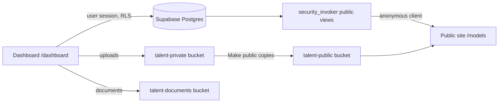

# 42 Agency OS architecture

## Layers

- **Database (`supabase/migrations`).** This is the source of truth.
  - RLS on every table.
  - Permissions resolved through `has_permission()` from `role_permissions` (see `permissions.md`).
  - Triggers enforce publishing and archive rights and write audit events.
- **Server code.** Every Supabase call runs under the caller's session, so RLS applies.
  - `src/lib/agency-auth.ts` resolves the user, their membership and their permissions once per request.
  - `requireApi()` guards API routes and `requirePage()` guards pages.
  - There is no service-role client.
- **Dashboard (`src/app/dashboard`, `src/features/*`).** Server-rendered pages load data per request. Client components post to `/api/dashboard/*` and call `router.refresh()` through `useMutation()`.
  - Shared UI lives in `src/components/ui`.
  - Talent sub-modules are driven by one registry: `features/talent/modules.ts` (API) and `features/talent/fields.ts` (forms and tables).
- **Public site (`src/app/models`, `src/features/public`).** Reads only the public views, through `createPublicSupabaseClient()`: the anonymous role, never the visitor's session.
  - `/models/[...path]` resolves board paths (`/models/teens/boys`) or talent slugs (`/models/<slug>`).
  - Pages render per request, so changes show immediately.

## Talent publication flow

1. Staff create a draft (`talent.create`).
2. Staff add details, measurements and boards, and upload media. Uploads go to `talent-private`.
3. "Make public" copies approved images to `talent-public`. The original is kept.
4. Publishing (`talent.publish`) sets `publication_status = 'published'` and `show_on_website = true`. A trigger checks the permission and writes the audit event.
5. The public views show the talent when it is published, visible, and not archived.
   - Board pages add one more condition: an assignment to a board that is itself public, meaning it and all its parents are active, published and not internal.
6. **Preview profile** (`/preview/talent/[id]`) renders the same public view for any status, with warnings about what will not be shown.

## Board flow

Boards form a tree. Each board's `path_segment` is unique among its siblings, and its URL is the chain of segments. Assigning or removing a board changes only `talent_board_assignments`, and those changes are audited. Deactivating or unpublishing a board hides it from the website without touching talent.

## Media flow

- **Photos:** upload to `talent-private`, add metadata, order with `reorder_talent_photos()`, choose the primary with `set_featured_photo()`, then publish, withdraw or archive. Publishing copies the file into `talent-public`; withdrawing removes that copy.
- **Portfolios and digital books:** ordered sets of the talent's photos. Only public images ever show on the website.
- **Videos:** YouTube or Vimeo embeds, or files uploaded privately and promoted like photos.

## Sensitive data

- **Legal, banking and medical:** each needs its own permission. Changes are audited by trigger without copying values, and banking numbers are masked in the UI; a reveal is logged.
- **Documents:** stored in the private `talent-documents` bucket and downloaded only through a 60-second signed URL. Each download is logged.
