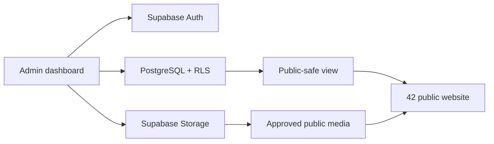

# 42 Agency OS architecture

The private dashboard reads and writes live Supabase data through server-side API routes. Browser clients never receive the server-only key. `src/lib/supabase.ts` is limited to browser-safe Auth actions, while `src/lib/supabase/server.ts`, the dashboard API routes, RLS policies, and migrations define the production boundary.

## Publication flow

Talent is created as a draft, enriched through the dashboard editor, assigned to a board, and explicitly published with `show_on_website = true`. Measurement snapshots are append-only history records. Public reads are limited to `public_talent_directory` and `public_talent_profiles`; private/legal/financial fields remain outside those projections.

## Implementation phases

The build follows the supplied order: foundation → dashboard shell → talent/boards → measurements/media → sensitive modules → public integration → search/applications/CMS → operations/exports/portal → security and QA.
