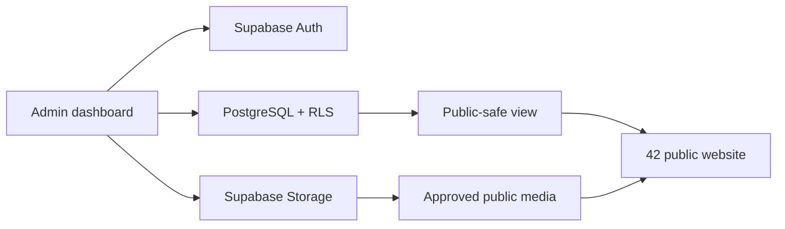

# 42 Agency OS architecture

The current UI uses a fictional local data adapter so it is useful before a Supabase project is configured. `src/lib/supabase.ts` and the SQL migrations define the production boundary for replacing that adapter with live reads and writes.

## Publication flow

Talent is created as a draft, enriched with media and measurements, assigned to one or more boards, then explicitly published with `show_on_website = true`. Public reads are limited to `public_talent_directory`; private/legal/financial fields remain outside that projection.

## Implementation phases

The build follows the supplied order: foundation → dashboard shell → talent/boards → measurements/media → sensitive modules → public integration → search/applications/CMS → operations/exports/portal → security and QA.

