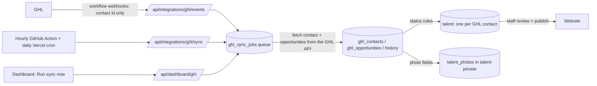

# GoHighLevel ↔ 42 Agency OS sync

GoHighLevel (GHL) stays the CRM. The dashboard mirrors **all** GHL contacts, opportunities, pipelines, stages and custom fields, gives each qualifying model **one** talent record, and keeps them up to date automatically. Staff review a talent and publish it to the website as a separate, manual step.

The older Join Us intake (applications) is still described in [ghl-integration.md](ghl-integration.md).



## What was found in GHL (2026-10-01)

These are real figures, read with the Private Integration token.

| | |
|---|---|
| Contacts | 374. 243 of them have opportunities. |
| Opportunities | 260 |
| Pipelines | 6. Talent Recruitment (103 opportunities), Talent Screening (69), Dallas Model and Talent Expo (88), Talent Quotation (0), Revenue (0), The Model Way Academy (0) |
| Custom fields | 121: 85 on contacts, 0 on opportunities, 20 on Business, 13 on Company Contact, 12 on Contact Person |
| Other | 14 custom values, 83 tags, 6 users |

**Photos** are contact `FILE_UPLOAD` custom fields:

| Field | Contacts with a file |
|---|---|
| Headshot (`contact.headshot`) | 194 |
| 3/4 Angle (`contact.34_angle`) | 142 |
| Full Body (`contact.full_body`) | 143 |
| Photo's of the Models (`contact.photos_of_the_models`) | 9 |

- Only `GET /contacts/{id}` returns file values; the contact search does not.
- Each file has a stable UUID. Its URL (`services.leadconnectorhq.com/documents/download/…`) redirects to `storage.googleapis.com` and needs no token.

**Status fields:** "Talent Status" and "Availability" exist but are empty for every contact. A person's real status is therefore their **pipeline stage**, plus the opportunity status (open, won, lost or abandoned).

**Guardian information:** GHL has no guardian fields, only a `parent` tag, so no guardian data is synced.

## Setup

### Environment variables (Vercel → Settings → Environment Variables, Production)

| Variable | Value | Notes |
|---|---|---|
| `GHL_API_TOKEN` | GHL → Settings → Private Integrations token (`pit-…`) | Secret. Read only by `src/features/ghl/client.ts`. |
| `GHL_LOCATION_ID` | Sub-account ID (`SHtE6KSa4XJKiIdqbd1T`) | |
| `GHL_WEBHOOK_SECRET` | Already set | The same secret is used for both webhook URLs |
| `CRON_SECRET` | New random value, at least 24 characters (`openssl rand -hex 32`) | Secret. Vercel Cron sends it automatically. |
| `SUPABASE_SECRET_KEY` | Already set | |

Also add `CRON_SECRET` as a **GitHub repository secret** (Settings → Secrets and variables → Actions). This lets `.github/workflows/ghl-sync.yml` run the hourly reconciliation.

### API scopes used

The token currently has every scope. The sync needs:

| Endpoint | Scope |
|---|---|
| `GET /opportunities/pipelines`, `GET /opportunities/search` | `opportunities.readonly` |
| `POST /contacts/search`, `GET /contacts/{id}` | `contacts.readonly` |
| `PUT /contacts/{id}` (write-back only) | `contacts.write` |
| `GET /locations/{id}/customFields?model=all` | `locations/customFields.readonly` |
| `GET /locations/{id}/customValues` | `locations/customValues.readonly` |
| `GET /users/` | `users.readonly` |

To reduce the blast radius if the token leaks, you can cut it down to these scopes. The import script also uses `forms.readonly` and `surveys.readonly`.

### GHL workflows (manual, in GHL → Automation)

Create **one** workflow named, for example, "Sync to 42 Agency OS" with these triggers:
- Contact Created
- Contact Changed
- Opportunity Created
- Pipeline Stage Changed
- Opportunity Status Changed
- Contact Tag Added / Removed

Give it one action:
- **Webhook** (the free one), method `POST`, URL `https://42-model-management-kappa.vercel.app/api/integrations/ghl/events`.
- Header `X-Webhook-Secret` = the `GHL_WEBHOOK_SECRET` value.
- Optional Custom Data `event` = a label such as `stage changed`, which is shown on the sync page.

The default payload already contains the contact ID; nothing else is needed.

The existing "Webhook Yzza for CMS" workflow (Active Talent → `/api/integrations/ghl`) keeps working: it now also triggers a full contact sync.

### First run

1. Apply migration `026_ghl_sync.sql`: `npx supabase db push --dry-run`, then `npx supabase db push`.
2. Seed today's mapping and review the forecast:
   ```bash
   node --env-file=.env scripts/ghl-initial-mapping.mjs
   ```
   Then run the same command with `--apply`.
3. Dashboard → **GHL Sync** → **Run sync now**. Or wait for the next hourly run.

## Data model (migration 026)

| Table | Holds |
|---|---|
| `ghl_contacts` | Every GHL contact: native fields, `custom_fields` (every field by GHL field ID, including unmapped ones), `raw` (full payload, server-only), `crm_status`, `programs`, `talent_id` (unique) |
| `ghl_opportunities` | Every opportunity: pipeline, stage, status, value, source, assigned user, raw |
| `ghl_opportunity_history` | Stage and status changes as the sync sees them. GHL's API has no history. |
| `ghl_pipelines`, `ghl_pipeline_stages` | Discovered automatically. Staff set `purpose`, `badge_label` and each stage's `normalized_status`. |
| `ghl_field_definitions` | Every custom field on every object, with `target` (dashboard field) and `ownership` |
| `ghl_custom_values`, `ghl_users` | Location-wide values (training dates, expo location) and GHL users (for "assigned to") |
| `ghl_status_rules` | Optional tag or field-value rules |
| `ghl_settings` | Which statuses create talent records; write-back switch |
| `ghl_sync_jobs` | Queue: one open job per contact, retries with backoff, `dead` after 8 attempts |
| `ghl_sync_runs` | Reconciliation runs, with cursor and counts |
| `ghl_webhook_events` | Webhook receipts, kept 30 days |
| `ghl_sync_conflicts` | Values both sides changed; resolved by an admin |
| `ghl_field_state` | The last value both sides agreed on, per talent and field. Used for loop prevention and conflicts. |

Changes to existing tables:
- **`talent`:** gains `crm_status` and `crm_programs`. Staff can read them; only the sync writes them; anonymous visitors never see them.
- **`talent_photos`:** gains `source`, `external_id` (the GHL file UUID, unique per talent), `source_url`, `photo_role` (headshot, three_quarter or full_body), `content_sha256` and `synced_at`.
- **`talent_measurements`:** gains `shirt_size`, `pants_size`, `dress_size` and `source`.

## Identity: one talent per GHL contact

The GHL contact ID is the primary key of the link. `ghl_contacts.talent_id` is unique, so a person in three pipelines is still one talent.

`ghl_link_talent()` decides what to link, in this order:
1. **Already linked:** use that talent.
2. **A converted Join Us application** for the same GHL contact: use its talent.
3. **Exactly one unlinked talent with the same email or phone *and* the same first name:** link it. Email alone is not enough, because siblings often share a parent's email.
4. **Otherwise,** if the contact's status qualifies, create a **private draft**.

Safeguards:
- Any open application for the contact is marked converted, so **Convert to talent** can never create a second record.
- `convert_application()` now links to an existing GHL-linked talent instead of duplicating it.
- Deleting a linked talent sets `auto_create_blocked`, so the sync does not recreate it.

## Status mapping

`normalized_status` is one of: lead, applicant, screening, accepted, enrolled, active, booked, graduated, inactive, rejected or archived.

How a contact's status is worked out (`src/features/ghl/status.ts`, unit tested):
1. Each opportunity in a pipeline with purpose **talent** contributes its stage's mapped status.
2. If the opportunity is **lost** or **abandoned**, its contribution becomes **inactive**.
3. Optional tag or contact-field rules contribute too.
4. The strongest **live** status wins. The order, from strongest, is: active, booked, enrolled, graduated, accepted, screening, applicant, lead.
5. If nothing live is left, the most recent of inactive, rejected or archived is used.
6. Client pipelines, unreviewed pipelines and unmapped stages contribute nothing.

`programs` are the dashboard tags (for example **Model Expo** or **Talent Recruitment**). A pipeline's tag is shown when the contact qualifies through it, meaning its status there is one of the talent-record statuses.

Starting mapping, seeded by `scripts/ghl-initial-mapping.mjs` and editable under GHL Sync → Mapping:

| Pipeline (tag) | Stage → status |
|---|---|
| Talent Recruitment Pipeline ("Talent Recruitment") | One-on-One / Group Casting Scheduled, Zoom Call Completed, No Show, Zoom Meeting Rescheduled → screening<br>Proposal Sent, Talent Enrollment Invoice Sent → accepted<br>Talent Enrollment Fee Paid, Onboarding Details Sent, Onboarding Documents Signed → enrolled<br>Active Talent → active<br>Rejected → rejected<br>Archived → archived |
| Talent Screening Pipeline ("Talent Screening") | New Lead → applicant<br>Under Review, Passed (for … Casting) → screening<br>Not a Fit/Rejected → rejected<br>Follow up Later → lead |
| Dallas Model and Talent Expo ("Model Expo") | New Lead → lead<br>Audition Completed, Interview Scheduled, For Follow Up → screening<br>Send Invoice, Pending Payment → accepted<br>Enrolled → enrolled |
| Talent Qoutation, Revenue Pipeline | Client pipelines; ignored for talent status |
| The Model Way Academy | Left for review (empty; "Closed" doesn't say whether someone enrolled) |

**Talent records** are created for the statuses **enrolled, active, booked and graduated**. You can change this list under Mapping. Everyone else stays visible under GHL Sync → Contacts, with a **Create talent** button.

**New pipelines and stages** are discovered on every run. They appear as "Needs review" or "Unmapped" and affect nobody until mapped. Their opportunities are still stored and linked.

## Field mapping and source of truth

Every custom field is stored in `ghl_contacts.custom_fields`, whether mapped or not, and shown on the talent's **CRM (GHL)** tab. Mapping a field (`target`) also copies its value into the talent profile. Known fields are seeded by their real GHL keys; new fields arrive unmapped and marked **New**.

| Ownership | Meaning | Default for |
|---|---|---|
| **GHL only** | GHL → dashboard. Dashboard edits are overwritten by the next GHL change. | Photos, ethnicity, and every unmapped field |
| **Both ways** | GHL → dashboard, and dashboard → GHL when write-back is on. Conflicts are recorded. | First and last name, email, phone, date of birth, address, gender, location, Instagram, TikTok, YouTube, height, bust/chest, waist, hips, weight, shoe, shirt, pants and dress size, hair and eye colour |
| **Dashboard only** | Never synced | Website visibility, publication, boards, portfolio order, bio, display name, CMS settings. These are not GHL fields at all. |

CRM status, pipeline, stage and opportunity status are always **GHL only**.

**Value rules** (`src/features/ghl/fields.ts`):
- Heights such as `5’9”` become centimetres.
- Bust, waist and hips: bare numbers up to 60 are read as inches.
- Weights are in pounds unless marked `kg`.
- Instagram URLs become `@handle`.
- Unreadable values (`N/A`, `Unknown`, `Test`) become **blank** in the profile, but the original text stays visible in the CRM tab.
- A **blank GHL value never erases** dashboard data.
- When two GHL fields map to the same target (Bust and Chest), the first readable value in name order wins.
- Measurements are history snapshots. A GHL change adds a new snapshot (`source = 'ghl'`) carrying the latest values.

## Loop prevention and conflicts

`ghl_field_state` stores, per talent and field, the value both sides last agreed on (the "base"). The merge is three-way (`src/features/ghl/merge.ts`, unit tested):

| Situation | Result |
|---|---|
| GHL value equals the base | Nothing happens. This includes the echo of our own push. |
| GHL changed, dashboard equals the base (or the field is GHL-only) | The GHL value is applied |
| Both sides changed to the same value | The agreement is recorded |
| Both sides changed to different values (field is "Both ways") | A **conflict** is created. Nothing is overwritten. An admin chooses **Use GHL**, **Keep dashboard** or **Dismiss**. |

**Outbound** pushes only "Both ways" fields whose dashboard value differs from the base, never blanks. Afterwards the base becomes the pushed value. The GHL webhook that follows sees GHL equal to the base, so nothing happens and the loop ends.

Sync writes use the secret key, so `auth.uid()` is empty. The `queue_ghl_push` trigger ignores them, which means an incoming change can never queue a push.

Values are compared after a round trip through GHL's format (centimetres → feet and inches → centimetres), so rounding never looks like a change.

**Write-back is off by default.** Turn it on under Mapping after testing on a test contact.

## Photos

`src/features/ghl/sync.ts` (`storePhotos`) handles photos for **talent-linked contacts only**:

1. Each GHL file (Headshot, 3/4 Angle, Full Body, Photo's of the Models) is downloaded once.
   - Every redirect hop must stay on an allow-listed host.
   - Downloads are capped at 15 MB.
2. It is re-encoded as a JPEG: auto-rotated, at most 2400px, with GPS and camera metadata removed.
3. It is stored as `talent-private/talent/<id>/ghl-<fileId>.jpg`.
4. A `talent_photos` row is recorded with `source = 'ghl'`, `external_id` (the file UUID), `photo_role`, `content_sha256`, the source URL and the sync time.

De-duplication:
- `(talent_id, external_id)` is unique, so a file is never downloaded twice.
- The same image uploaded under two fields is detected by its SHA-256 and stored once.
- A file that fails three times is skipped and listed in the logs.

Photos arrive **private and unpublished**. Staff choose the cover and **Make public** in the Media tab, exactly as before.

## Automatic sync, retries and scale

- **Webhooks** (`/api/integrations/ghl/events`) record the event, queue the contact, reply `202`, and then process the queue for up to about 50 seconds.
- **Reconciliation** (`/api/integrations/ghl/sync`) runs hourly from GitHub Actions and daily from Vercel Cron, and on demand with **Run sync now**. It works through these steps:
  1. Discovery: pipelines, stages, fields, custom values and users.
  2. Every opportunity, 100 per page.
  3. Every contact, 100 per page, sorted by last update. Contacts that changed since their last full fetch are queued.
  4. The queue is drained.
  5. Clean-up: after a complete scan, contacts and opportunities GHL no longer has are marked `removed_at`. Nothing is deleted.
  - Each invocation works for about 50 seconds and saves a cursor. The next call continues from there, and the cron route calls itself, up to 30 hops.
- **Rate limits:** the client follows GHL's `x-ratelimit-*` headers and backs off exponentially, with jitter, on 429 and 5xx responses.
- **Failures:** failed jobs retry after 2, 4, 8 … minutes, up to 6 hours apart. After 8 attempts they are marked **dead** and wait for **Retry failed**.
- **Scale:** every step pages and uses ID-keyed upserts, so running it twice changes nothing. Cost grows with the number of *changed* contacts, not with the total.

## Website and CMS

- The website reads only the existing public views. It never reads `ghl_*` tables, `crm_status` or unpublished drafts.
- A GHL-created talent is a private draft until staff publish it. An **Active** CRM status does **not** publish anyone.

## Security

- The token, webhook secret and cron secret are server-only environment variables. Tests check that only `src/features/ghl/client.ts` reads `GHL_API_TOKEN`, and that no `NEXT_PUBLIC_` variable holds a secret.
- **Webhooks:** the secret is compared in constant time, before the body is read. Bodies are limited to 256 KB. The body is used only to find a contact ID, and the server fetches that contact from GHL itself, so a forged body cannot inject data.
- **Cron:** requires `Authorization: Bearer <CRON_SECRET>`.
- **Dashboard:** routes require `integrations.manage`. The secret-key engine (`src/features/ghl/engine.ts`) is imported only by authenticated routes, which a test enforces.
- **Row-level security:** `ghl_*` tables are readable only with `integrations.view` (owner, administrator and talent manager). Raw payloads are not readable through the API at all. Talent logins and anonymous visitors see nothing.
- **Audit:** mapping and settings changes, conflict resolutions, talent creation, linking, and staff-run syncs are all written to `audit_logs`.

## Verification status

See the final report in the conversation or the latest entry in `docs/qa-report.md`. Anything not verified against production is marked **BLOCKED** there.
